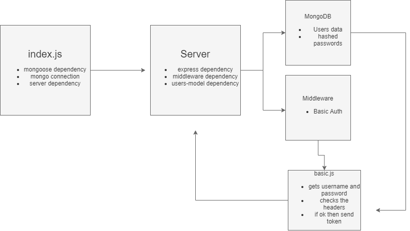

# authentication
Server with user authentication and modularized routing/middleware

## Project: Authentication

### Author: Brendon

### Links and Resources

- [submission PR](https://github.com/brendon-401-advanced-javascript/authentication/pull/4)
- [ci/cd](https://github.com/brendon-401-advanced-javascript/authentication/actions) (GitHub Actions)
- [back-end server url](http://xyz.com) (when applicable)
- [front-end application](http://xyz.com) (when applicable)

### User Stories

* As a user, I want to present my token instead of my username and password so that I can access protected routes more securely
* As a developer, I want to protect any route on my server by requiring a valid token to access it
* As a developer, I want to create and manage secure tokens so that my users information will be secure

### Setup

#### `.env` requirements (where applicable)

npm i and add a .env file to your repo, then set the port to 5000. you will also need to setup in env SECRET= (*any secret word you want) before you make any data for database. 

#### How to initialize/run your application (where applicable)

--TO RUN THE APPLICATION--
- In the Terminal(s) run 
    - nodemon, mongo

#### How to use your library (where applicable)

#### Tests

- How do you run tests?
    - 
- Any tests of note?
- Describe any tests that you did not complete, skipped, etc
    - 

#### UML

Link to an image of the UML for your application and response to events

[Return to Directory](##Directory)

